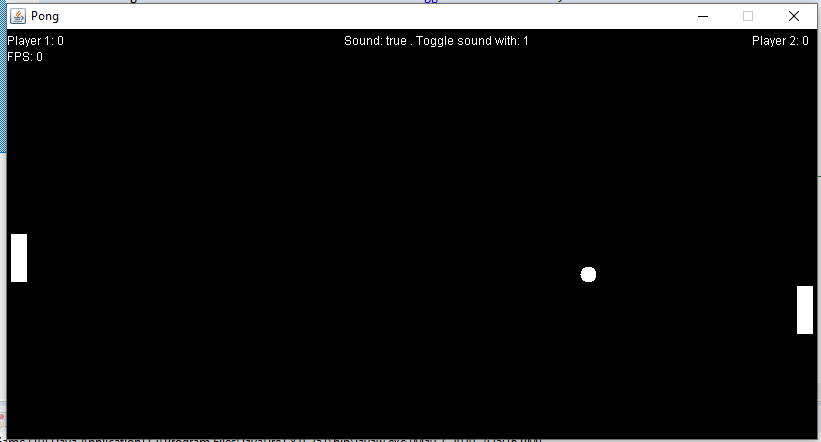
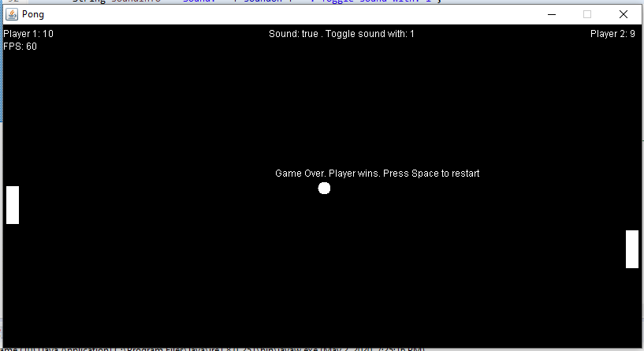

# JavaPong

One of my first game. A remake of the popular game Pong. It includes a player paddle that is controlled by the user with the "W" and "S" keys. A ball that bounces of the top and bottom walls as well as the Player/AI paddle. And an AI paddle that follows the ball when the ball is in its half of the game. When the ball reaches the left or side of the screen, the opposite player receives a point. Once a player reaches 1o points, the winner is announced and the user can restart the game with the "Space" key. Sound plays when the ball bounces and can be enabled/disabled with the "1" key.

The application uses Java AWT (Abstract Window Toolkit) and swing manage the game rendering and controlling. Everything is rendered in a canvas using a BufferStrategy and Graphics object.

The Canvas is inside a JFrame and is updated on a separate thread that uses a game loop to call a tick() and render() method at 60 calls a second.

The game logic is handled inside a Handler class which holds the PlayerPaddle, GamePaddle and Ball object and call their tick() method to update them and calls their render() method to render. The Handler class is also a KeyListener and saves when keys are pressed/released in order to update game.

Sound is also played when the ball bounces or reaches a border. The SoundPlayer class plays a custom "Beep" sound using AudioFormat and SourceDataLine. Originally, the sound was played in the same loop as the update loop but this caused a slight lag while the sound was playing because the game thread could not continue until the sound finished playing. This was later updated to call a new thread every time sound is in order to keep the game thread more smooth.
